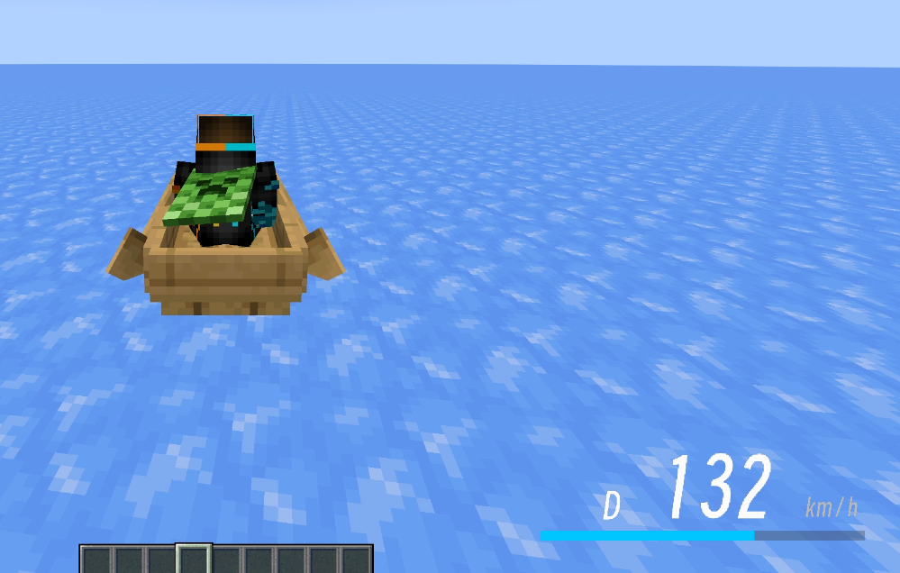
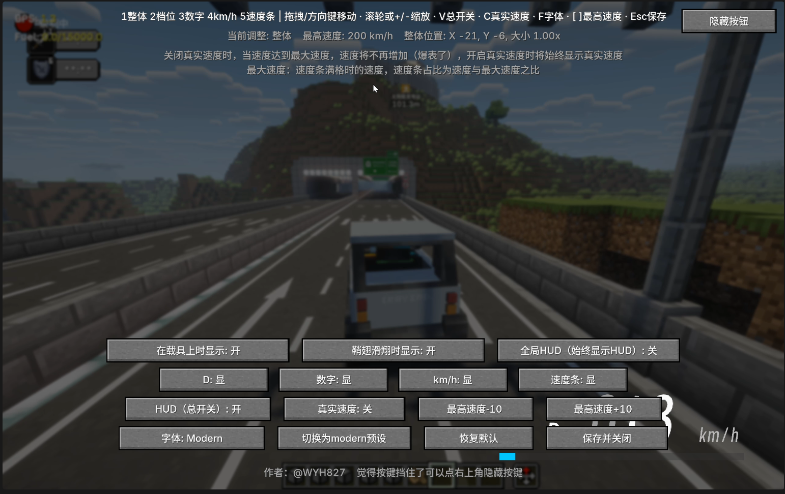

# BetterSpeedHUD

A Minecraft Forge speed HUD mod that displays your speed, gear, and a speed bar in the bottom-right corner of the screen while riding vehicles or gliding with an Elytra. All elements can be freely adjusted in-game.

> A Better HUD mod to show your speed on your screen. Highly customizable. @WYH827



## Supported Versions

| Directory | Minecraft | Forge | Java |
| --- | --- | --- | --- |
| [forge-1.20.1](forge-1.20.1) | 1.20.1 | 47.x | 17 |
| [forge-1.21.1](forge-1.21.1) | 1.21.1 | 52.x | 21 |

## Features

- **Real-time speed display**: Calculates speed based on the player's actual coordinate displacement (blocks/second × 72 to convert to km/h). Compatible with vanilla vehicles and modded vehicles such as MrCrayfish vehicles. Elytra gliding is also supported.
- **Customizable layout**: Left-side `D` gear indicator, three large speed digits in the center (leading zeros are gray), `km/h` on the right, and a speed bar underneath.
- **Adjustable maximum speed** (default: 200): The speed bar is always displayed as a percentage of `speed / maximum speed`. Values exceeding the maximum are capped at 100%.
- **Real speed toggle**: When disabled, the displayed speed stops increasing after reaching the maximum speed (speedometer maxed out). When enabled, the actual speed is always displayed.
- **Two fonts**: Minecraft's default font / Modern bitmap font (switchable in-game).
- **In-game configuration screen** (press **H**, or click the **Config** button in the Mod Menu):
  - The overall HUD, D indicator, numbers, `km/h`, and speed bar can each be independently adjusted for position, size, and visibility.
  - Position and size can be adjusted using dragging, arrow keys, the mouse wheel, and keyboard shortcuts.
  - The **Hide Buttons** button in the top-right corner can hide all buttons, making it easier to observe and position the HUD.
  - One-click switching to the Modern preset / restoring the default configuration.
- **Display conditions**: Show while riding a vehicle / show while gliding with an Elytra / always show globally. When global display is enabled, the first two options are locked to enabled.
- **Bilingual interface**: Follows the game's language settings — Simplified/Traditional Chinese displays Chinese, while other languages display English.



## Installation

1. Select the appropriate version of the jar from the table above (available from Releases or build it yourself).
2. Put the jar into the `.minecraft/mods` folder.
3. Launch the game, enter a world, and ride a vehicle or glide with an Elytra to see the HUD.

## In-Game Configuration

Press **H** to open the configuration screen.  
(The key can be changed in the Controls settings; the default key is **H**.)

| Key | Function |
| --- | --- |
| `1` ~ `5` | Select the element to adjust (Overall / Gear D / Numbers / km/h / Speed Bar) |
| Arrow Keys / Mouse Drag | Move the selected element |
| Mouse Wheel / `+` `-` | Scale the selected element |
| `V` | Toggle HUD on/off |
| `C` | Toggle Real Speed |
| `F` | Switch Font (Minecraft / Modern) |
| `[` `]` | Decrease/increase maximum speed |
| `Esc` / **Save and Close** | Save the configuration and close |

The configuration file is located at:

```text
.minecraft/config/speedhud-client.toml
```

## Building

Enter the corresponding version directory and run:

```bat
gradlew build
```

The built jar will be located in:

```text
build/libs/
```

## Modern Font

The Modern font is a custom bitmap font generated from **Smiley Sans Oblique**. Its specifications can be found in the following file within each version directory:

```text
src/main/resources/assets/speedhud/font/modern.json
```

## Open Source License

This project is released under the **MIT License**. See [LICENSE.txt](LICENSE.txt) for details.

## Author

@WYH827
